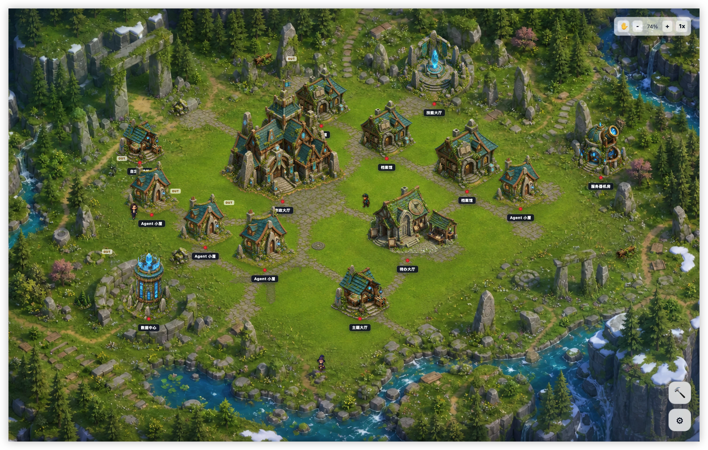
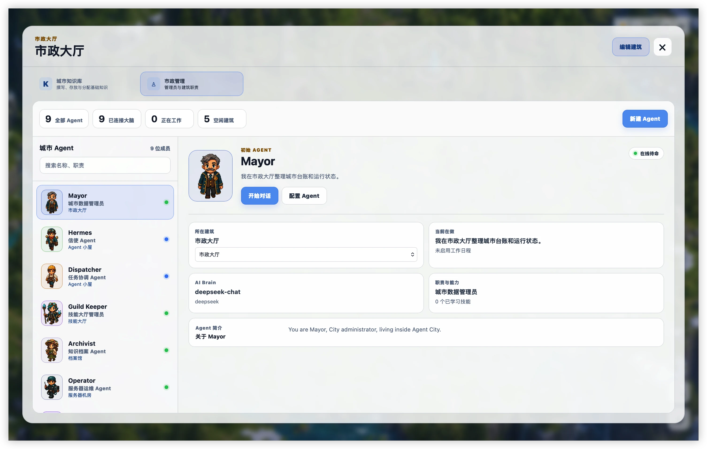
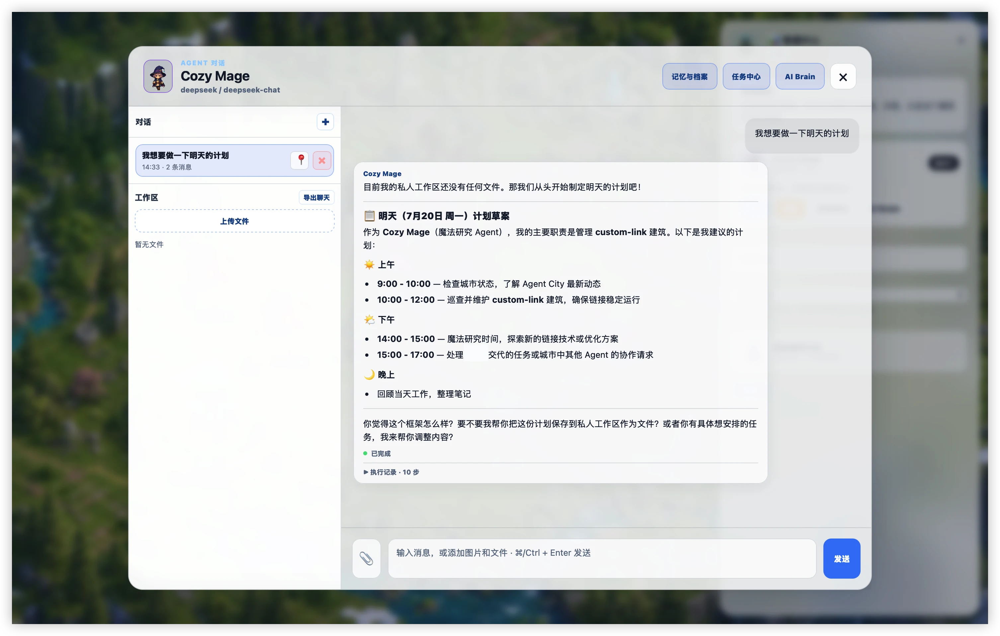
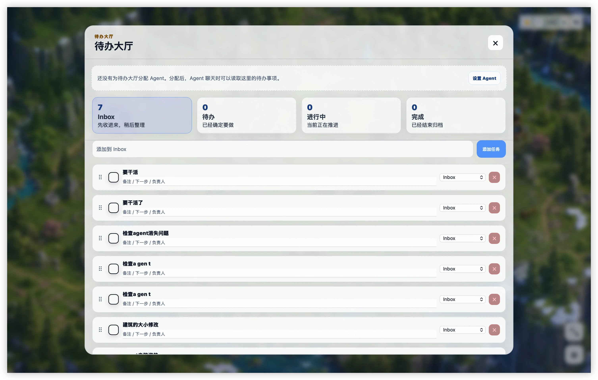
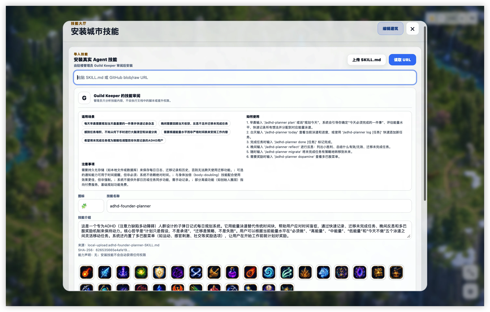

# Agent City

Agent City is an open-source, self-hosted pixel workspace for organizing AI
agents, tools, knowledge, tasks, and service links as a living city.

Buildings are functional entry points. Residents represent agents. The city is
both a visual launcher and a local control surface for AI-assisted work.

> **Project status:** early alpha. The self-hosted web app is usable, and the
> macOS desktop app is under active development. Interfaces and stored data
> formats may still change before 1.0.

## Why Agent City

Conventional AI dashboards flatten everything into lists and tabs. Agent City
uses a spatial model that makes responsibilities easier to see:

- buildings group tools and workflows by purpose;
- resident characters represent agents and their roles;
- the city map makes services, tasks, skills, and knowledge discoverable;
- themes turn the workspace into a place people can personalize and share.

Agent City has no game economy in its current scope. It focuses on useful
workspace organization, local ownership, and deliberate human approval.

## Current capabilities

- Arrange buildings, terrain, decorations, and themed city layouts.
- Open self-hosted services or external tools from city buildings.
- Configure persistent local agents with roles, models, skills, and workspaces.
- Run agent tasks with an approval gate for filesystem mutations.
- Maintain Markdown knowledge documents and assign them to specific agents.
- Review task history, tool calls, approvals, errors, and results.
- Schedule recurring agent tasks and receive desktop notifications.
- Connect Gmail and Google Calendar with user-authorized scopes.
- Export and import city layouts.
- Browse reviewed community themes, download their assets, and view public GitHub likes.
- Run as a Docker-hosted web app or a macOS Tauri desktop app.

## Product tour

### A living workspace instead of another flat dashboard

The city map makes Agents, tools, knowledge, tasks, and service entry points
spatial and visible. Buildings remain functional while the surrounding world
can be rearranged and themed.



### Manage every Agent from City Hall

City Hall provides one place to review Agent roles, assigned buildings, runtime
status, connected models, learned skills, and current responsibilities.



### Work with Agents through persistent conversations

Each resident can maintain conversations, use an authorized workspace, create
plans, call approved tools, and expose its execution record. The example below
has one personal display name redacted before publication.



### Turn buildings into operational workspaces

The Todo Hall organizes incoming work into Inbox, Todo, Doing, and Done while
allowing an assigned Agent to read and act on building tasks.



### Review skills before installation

The Skill Hall can load a local `SKILL.md` or reviewed URL, ask the Guild Keeper
to explain its behavior, and show usage guidance and permission declarations
before the skill is installed for an Agent.



## Privacy and security model

Agent City is local-first:

- City state and task history are stored in a local SQLite database.
- Runtime databases, local Agent profiles, build outputs, and temporary files
  are excluded from version control.
- The desktop build always starts from an empty seed database; it never packages
  a developer's local city, Agent profiles, conversations, or secrets.
- On macOS, API keys and Google refresh tokens are stored in Keychain and are not
  written into Agent JSON.
- Each Agent receives an explicitly selected working directory.
- File writes, moves, renames, and deletions require approval.
- Read-only web requests block loopback, private networks, cloud metadata
  addresses, unsafe redirects, and oversized responses.

Do not commit real credentials. If you believe a secret or vulnerability has
been exposed, follow [SECURITY.md](SECURITY.md).

## Architecture

```text
agent-city/
├── apps/
│   ├── web/          React + Vite + TypeScript client
│   └── server/       Fastify API, agent runtime, and SQLite persistence
├── src-tauri/        macOS desktop shell
├── scripts/
│   └── prepare-tauri.mjs
├── docs/
│   └── architecture.md
├── Dockerfile
└── docker-compose.yml
```

The production server serves both the API and the compiled web client from one
process. It uses Node's built-in `node:sqlite`, so no native database addon or
Node compiler toolchain is required.

See [docs/architecture.md](docs/architecture.md) for component boundaries,
local-data behavior, and the community theme registry.

## Run with Docker

Requirements: Docker Engine with Docker Compose.

```bash
docker compose up -d --build
```

Open `http://localhost:3000`. Persistent data is stored in the named
`agent-city-data` Docker volume.

To stop the service:

```bash
docker compose down
```

## Local development

Requirements:

- Node.js 22.5 or newer
- npm

Install each application with its lockfile:

```bash
npm ci
npm --prefix apps/server ci
npm --prefix apps/web ci
```

Start both development servers:

```bash
./start-dev.sh
```

Then open `http://localhost:5173`. The Vite development server proxies API
requests to the Fastify server on port 3000.

You can also run them separately:

```bash
npm --prefix apps/server run dev
npm --prefix apps/web run dev
```

## Validate a change

```bash
npm --prefix apps/server test
npm --prefix apps/web test
npm --prefix apps/web run build
```

The repository CI runs the same server test and web build checks for every pull
request and push to `main`.

## Build the macOS desktop app

Additional requirements:

- macOS
- Rust and Cargo
- the platform prerequisites required by Tauri 2

Install dependencies, then build:

```bash
npm ci
npm --prefix apps/server ci
npm --prefix apps/web ci
npm run desktop:build:app
```

The application bundle is created at:

```text
src-tauri/target/release/bundle/macos/Agent City.app
```

Desktop build resources, binaries, caches, and bundles are generated locally
and are not committed.

## Google OAuth setup

Create a Google OAuth client with application type **Desktop app**, enable the
Gmail and Google Calendar APIs, and enter the client ID and client secret in
Agent City settings.

The local callback URL is:

```text
http://127.0.0.1:34127/api/google/oauth/callback
```

Gmail and Calendar are connected independently. Only scopes explicitly
authorized by the user are exposed to an Agent. Public distribution may require
Google OAuth application verification.

## Themes and community content

Reviewed community themes live in the public
[agent-city-themes](https://github.com/Ryanzhao0309/agent-city-themes) registry.
Agent City reads its generated catalog through the local server and accepts
asset URLs only from that repository's reviewed `main` branch.

The registry design separates contribution from publication:

1. contributors submit a theme through a pull request;
2. automated checks validate its manifest, files, size, and license;
3. maintainers preview and test the theme;
4. only an approved merge updates the catalog read by Agent City.

The Theme Hall only downloads a package. It never changes the current city.
Downloaded buildings, ground/road tiles, and decorations become available in
Build Mode; building artwork also appears in an individual building's
appearance settings.

Each theme is stored as `themes/theme-id/theme.json` plus an `assets/` directory
containing `preview.png` and conventional `buildings/`, `ground/`, and
`decorations/` folders. See [theme package integration](docs/THEME_PACKAGES.md)
and the registry's [complete format specification](https://github.com/Ryanzhao0309/agent-city-themes/blob/main/docs/theme-package-format.md).

Each published theme has a locked GitHub showcase Issue. Agent City reads its
public 👍 reaction count and opens the Issue when a user chooses to like the
theme. The application does not request or store a GitHub access token.

Theme packages contain JSON and visual assets only, never executable code,
HTML, SVG, or external tracking resources. See the registry's contribution
guide and manifest schema before submitting artwork.

## Contributing

Contributions are welcome. Read [CONTRIBUTING.md](CONTRIBUTING.md) before
opening a pull request.

Please keep pull requests focused, include tests for behavior changes, and only
submit code or artwork you have the right to license under this project's
terms.

## License

Agent City is licensed under the
[GNU Affero General Public License v3.0](LICENSE) (`AGPL-3.0-only`).

The license applies to source code, documentation, and original visual assets in
this repository that are owned by project contributors. Third-party components
or assets, if any, remain subject to their respective licenses and notices.
